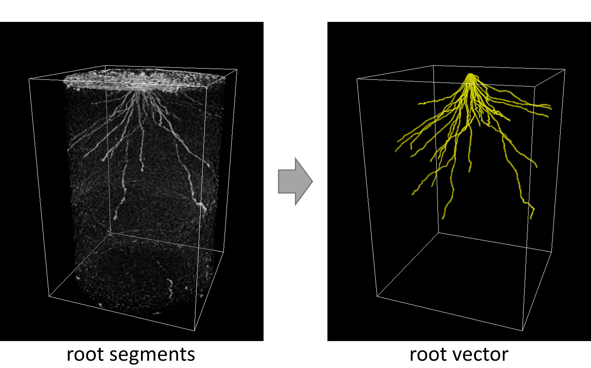

# RSAtrace3D: a root system architecture vectorization software for monocot plants


 

## introduction

RSAtrace3D is a vectorization software to measure RSA (root system architecture) traits of monocot plants from 3D volume data such as X-ray CT images. Traits of  interest could be quantified by installing additional packages that could be freely designed by the users.

## system requirements

A mouse and keyboard are required for the operation. Windows and Linux are recommended because RSAtrace3D uses the `Delete` key. Since it draws an isocurve, it may be difficult to be seen on a high-resolution display, such as a retina display. The amount of memory usage depends on the size of the 3D image data handled. Version 3.6 or higher versions of Python must be installed.

RSAtrace3D depends on the following packages:

- numpy
- scipy
- scikit-image
- pandas
- PyQt5
- pyqtgraph
- psutil

The confirmed operating environment is shown below:

- CPU: Intel<sup>(R)</sup> Core<sup>(TM)</sup> i7-8700 CPU @ 3.20 GHz
- Memory: 32 GB
- Ubuntu (18.04.4 LTS)
- Python (3.6.9)
    - numpy (1.18.4)
    - scipy (1.4.1)
    - scikit-image (0.17.1)
    - pandas (1.1.0)
    - PyQt5 (5.14.2)
    - pyqtgraph (0.10.0)
    - psutil (5.7.0)

## installation

Run the following commands:

```
git clone https://github.com/st707311g/RSAtrace3D.git
cd RSAtrace3D
```

## how to use

A manual file is avairable [here](./manual/how_to_use.md).

## version policy

Version information consists of major and minor versions (major.minor). When the major version increases by one, it is no longer compatible with the original version.When the minor version invreases by one, compatibility will be maintained. Revisions that do not affect functionality, such as bug fixes and design changes, will not affect the version number.

## license

RSAtrace3D is dual licensed under the Massachusetts Institute of Technology (MIT) license (https://opensource.org/licenses/mit-license.php) and a commercial license. For academic use, RSAtrace3D is under the MIT license. Otherwise, RSAtrace3D is under the commercial license. Please contact the National Agriculture and Food Research Organization.

## citation

Please cite the following article:

Shota Teramoto et al. RSAtrace3D: robust vectorization software for measuring monocot root system architecture (2021) in press.

## copyright

National Agriculture and Food Research Organization (2020)

## project homepage
https://rootomics.dna.affrc.go.jp/en/

## update history

* version 1.0 (Jan 6, 2020)
  * initial version uploaded
* version 1.1 (June 4, 2021)
  * update: mod - traits
  * install: mod - traits debug function
  * install: projection view slice line
  * install: manual
  * fix: behavior when the spacebar is pressed
  