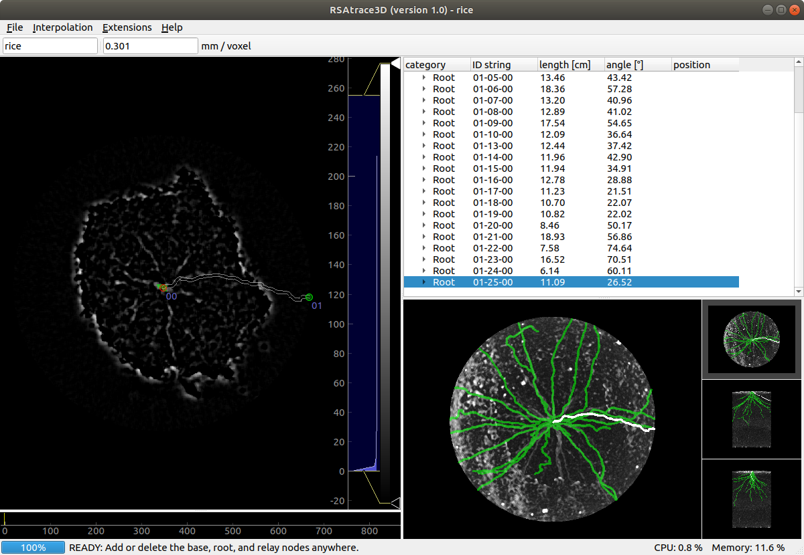
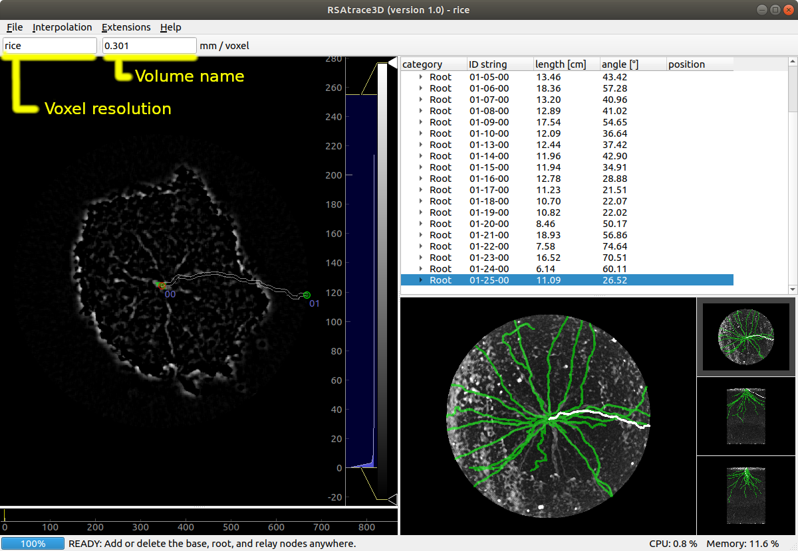
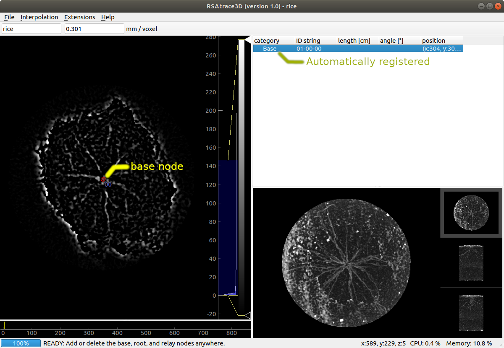
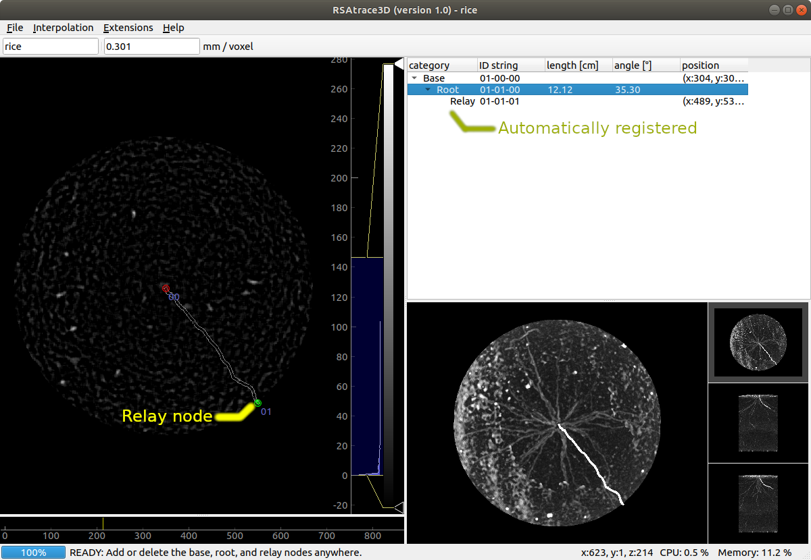
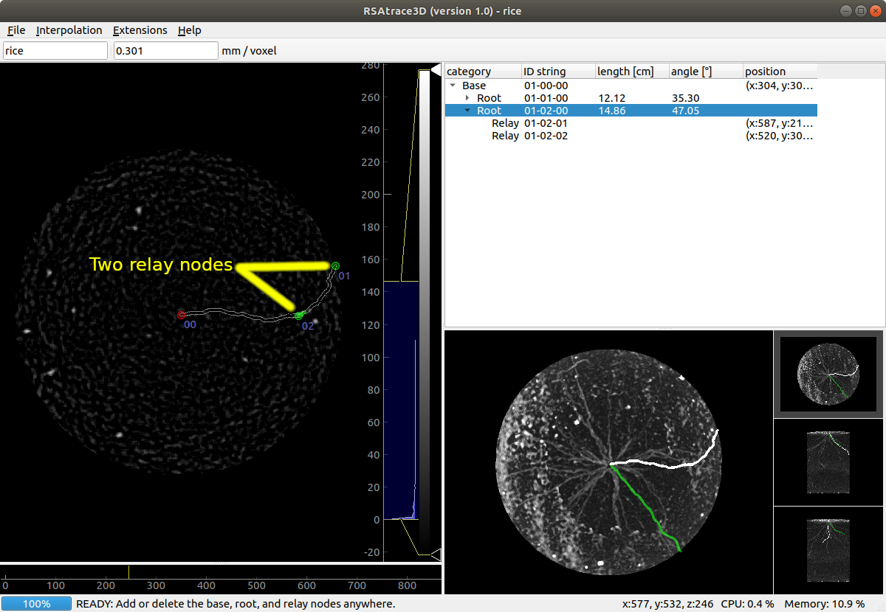
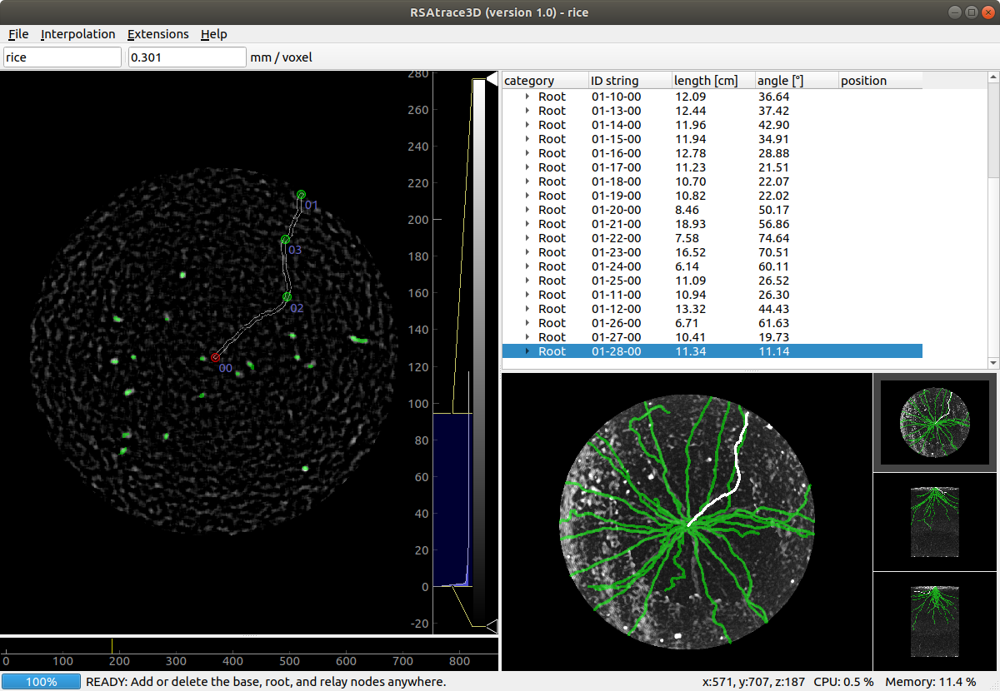
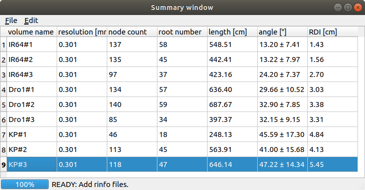

# RSAtrace3D: a root system architecture vectorization software for monocot plants

<div style="text-align: right;">version 1.0</div>

<div style="text-align: right;">Software and manual created by Shota Teramoto (teramotos154@affrc.go.jp)</div>

<div style="text-align: right;">October 30, 2020</div>

## Introduction


## License

RSAtrace3D is dual licensed under the Massachusetts Institute of Technology (MIT) license (https://opensource.org/licenses/mit-license.php) and a commercial license. For academic use, RSAtrace3D is under the MIT license. Otherwise, RSAtrace3D is under the commercial license. Please contact the National Agriculture and Food Research Organization.

## Installation

### System requirements

A mouse and keyboard are required for the operation. Windows and Linux are recommended because RSAtrace3D uses the **Delete** key. Since it draws an isocurve, it may be difficult to be seen on a high-resolution display, such as a retina display. The amount of memory usage depends on the size of the 3D image data handled. Version 3.6 or higher versions of Python must be installed.

RSAtrace3D depends on the following packages:

- numpy
- scipy
- scikit-image
- pandas
- PyQt5
- pyqtgraph
- psutil

The confirmed operating environment is shown below:

- CPU: Intel<sup>(R)</sup> Core<sup>(TM)</sup> i7-8700 CPU @ 3.20 GHz
- Memory: 32 GB
- Ubuntu (18.04.4 LTS)
- Python (3.6.9)
    - numpy (1.18.4)
    - scipy (1.4.1)
    - scikit-image (0.17.1)
    - pandas (1.1.0)
    - PyQt5 (5.14.2)
    - pyqtgraph (0.10.0)
    - psutil (5.7.0)

## Working with RSAtrace3D

### The main window of RSAtrace3D

The graphical user interface (GUI) of RSAtrace3D comprises the slice, tree, and projection viewers (Figure 1). At the slice viewer, a vertical slice of a volume at any position is shown. At the tree viewer, registered node information is summarized. Root traits measured are presented in this viewer. At the projection viewer, the projection image of the vector data merged with one of the volume images is shown to help users' efficient operation.

 

### Starting RSAtrace3D

Move to the RSAtrace3D directory containing **\__main__.py** file, and run the following command:
```
pyhton .
```

If you do not have the required packages installed, please install them.

### Volume importing

Volume data, which should be stored in a directory, are imported by dropping the directory on the window or selecting **File** -> **Open volume** menu to get an open dialog. The portable network graphics (PNG) or tagged image file format (TIFF) images are accepted. After importing, a volume slice and projection image are illustrated in the slice and projection viewers, respectively. The volume name and voxel resolution are respectively shown on the toolbar. They are to be stored with trace data file and used for root trait measurements, so fill the correct value out.

 

### Selecting the interpolation method

An interpolation method is selected using **Interpolation** menu.

### Node registration

The base, root, and relay nodes are placed by utilizing the keyboard and mouse operations. The image brightness and contrast are modified using the widget right to the slice viewer. Moreover, the showing slice is changed by a mouse wheeling or slide placed below the slice viewer. 

The first step is the base node registration. After finding a slice where shoot:base junction is located, move the mouse cursor just on the junction and click the **left** mouse button using the **Ctrl** and **Shift** keys. A red circle is placed on the slice viewer, and the registered base nodes are automatically listed on the tree view.

 

The second step is the relay node registration. By changing the showing slice and moving the mouse cursor just on the root tip, click the **left** mouse button. Then, a green circle is placed on the slice viewer, and the registered root and relay node are automatically listed on the tree view. 

 

If a single relay node is insufficient to trace a root, more relay nodes are additionally register-able. One can add additional relay nodes by clicking the **left** mouse button using the **Ctrl** key.

 

Repeat this process until all roots are traced. 

 

Now, the entire RSA has just been vectorized. The RSA data are stored in **File** -> **Save rinfo file** menu. The root trait data shown in the tree viewer are stored in **File** -> **Export root traits (csv)** menu. The projection images are stored in **File** -> **Export projection image** menu. The trace images are stored in **File** -> **Export trace images** menu. All data are stored in the same location as the volume data.

### Other technical tips

- The isocurve and node marks on the slice viewer and the unselected root traces on the projection viewer will be hidden while holding down the **spacebar**. 
- A node can be selected by clicking on the slice view and a root trace on the projection viewer.
- The selected node can be deleted by pressing the **delete** key.

### RSA measurements

RSA traits are displayed in the summary window. Open the summary window using **Extensions** -> **RSA summary** menu. Drop the rinfo file into a window or open it from the file menu. Afterward, the RSA traits are automatically calculated and displayed in the table view. The RSA trait data shown in the summary window are stored using **File** -> **Export RSA traits (csv)** menu.

 

## Algorithm Extensions

The interpolation methods, trait measurements, and other functions are extensible by users. Additionally, their codes are stored in **mod/Interpolation**, **mod/Traits**, and **mod/Extensions**, respectively. Copy, rename, and edit **\__templete__.py** to implement the code. The implementation examples are stored in these directories.

## Update history

* version 1.0 (Jan 6th, 2020)
  * initial version uploaded
* version 1.1 (d)
  * update: mod - traits
  * install: mod - traits debug function
  * install: projection view slice line
  * fix - behavior when the spacebar is pressed
  