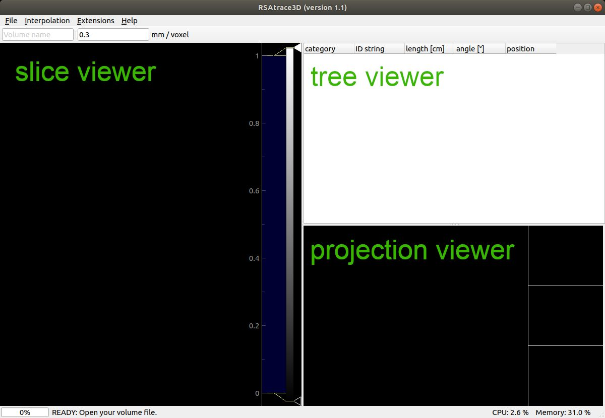
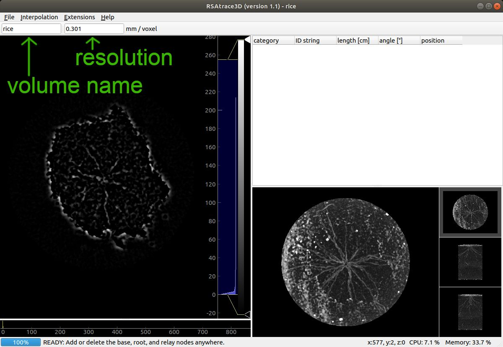
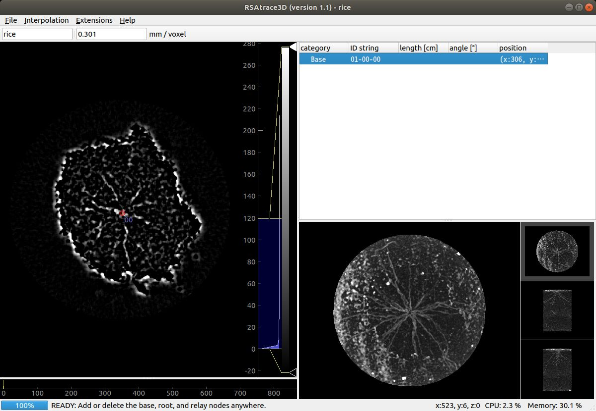
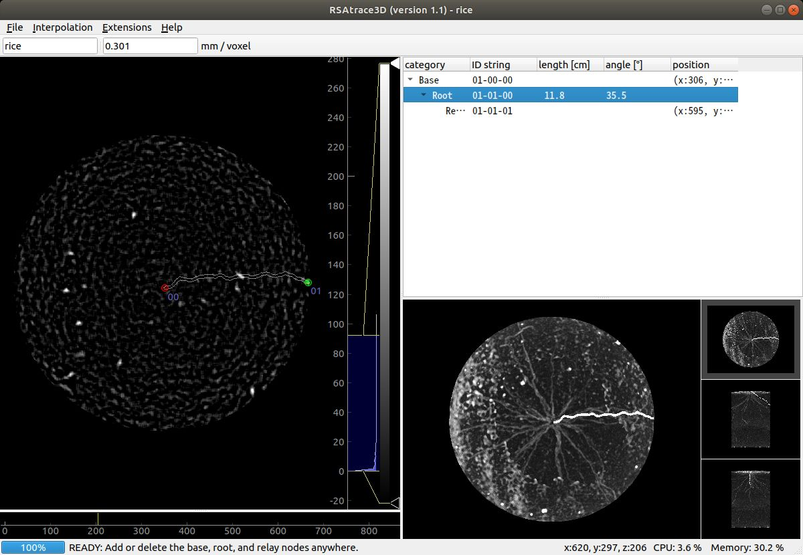
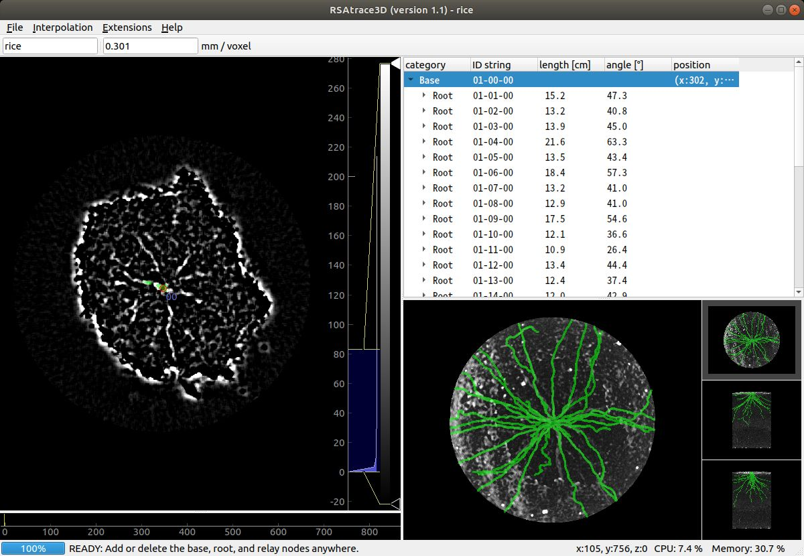
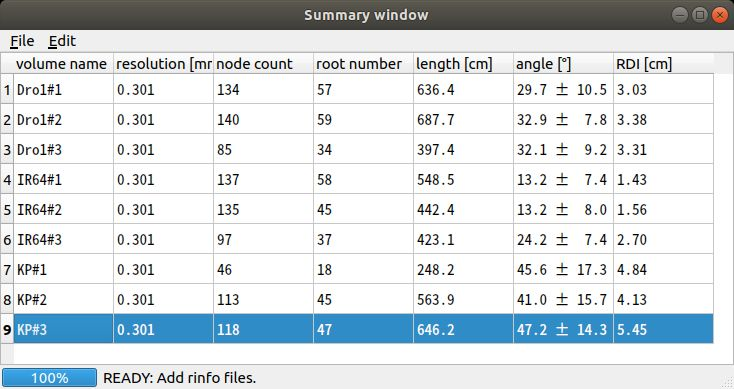

# RSAtrace3D: user's manual


## running program

Move to the RSAtrace3D root directory which contains `__main__.py` file, and run the following command:
```
pyhton .
```

If environment is correctly installed, the main window will appear. 

## graphical user interface (GUI)

The graphical user interface (GUI) of RSAtrace3D comprises the slice, tree, and projection viewers. The slice viewer shows a vertical slice of a volume. The tree viewer shows registered node information such as root traits. The projection viewer shows the projection image of the volume to help users' operation.

 

### volume importing

To import a volume data stored in a directory, click `File` -> `Open volume` menu or press `Control+O` to open a dialog window. Indicate the directory you want to open. Alternatively, you can drag and drop the directory into the RSAtrace3D window. After importing, a slice and a projection image are showed in the slice and projection viewers, respectively. The image brightness and contrast are modified using the widget right to the slice viewer. The showing slice is changed by a mouse wheeling or slide placed below the slice viewer. 

The volume name and voxel resolution are respectively shown on the toolbar. They are to be stored with trace data file and used for root trait measurements, so fill the correct value out.

 

### selecting the interpolation method

Select an interpolation method in `Interpolation` menu. `Straight`, `Spline`, and `COG tracking` are selectable. `Straight` connects the nodes with straight lines. `Spline` connects the nodes with spline line. `COG tracking` connects the nodes by tracking root segments between nodes. If you use the image  of which plant root segments are brightened, `COG tracking` is recommended.

### node registration

The `base`, `root`, and `relay` nodes are placed by utilizing the keyboard and mouse operations. 

#### base node

Find a slice where shoot:base junction is shown, and move the mouse cursor just on the junction and click the `left` mouse button with `Ctrl+Shift` pressed. A red circle will be placed on the slice viewer, and the registered base nodes will be automatically listed on the tree view.

 

### relay and root node

For a given root of interest, find a slice where root tip is shown, and move the mouse cursor just on the root tip and click the `left` mouse button. A green circle will be placed on the slice viewer, and the registered root and relay node will be automatically listed on the tree view. 

 

If a single relay node is insufficient to vectorize the root of interest, more relay nodes could be additionally register-able by clicking the `left` mouse button with `Ctrl` key pressed.

 

Repeat this process until all roots are vectorized. 

 

### saving files

Several data could be saved. The type of data that could be saved and how to save them are as follows.

| items to save | menu | shortcut |
| ---- | ---- | ---- |
| vectorized data (rinfo data) |  `File` -> `Save rinfo file`  | `Control + S` |
| projection images |  `File` -> `Export projection image`  | `Control + P` |
| trace images |  `File` -> `Export trace images`  | `Control + T` |
| root trait data (.csv) |  `File` -> `Export root traits (csv)`  | `Control + E` |

All data will be stored in the same location as the directory containing volume data.

### other technical tips

- The node marks on the slice viewer and the unselected root traces on the projection viewer could be hidden while holding down the `spacebar`. 
- Root of interest could be selected by clicking a node on the slice view or a root trace on the projection view.
- The selected node could be deleted by pressing the `delete` key.

### RSA trait measurements

RSA traits are calculated in the summary window that could be opened using `Extensions` -> `RSA summary` menu. A rinfo file could be opened by dropping it on the summary window. Afterward, RSA traits will be automatically calculated and displayed in the table view. The RSA trait data shown in the summary window could be saved using `File` -> `Export RSA traits (csv)` menu.

 
